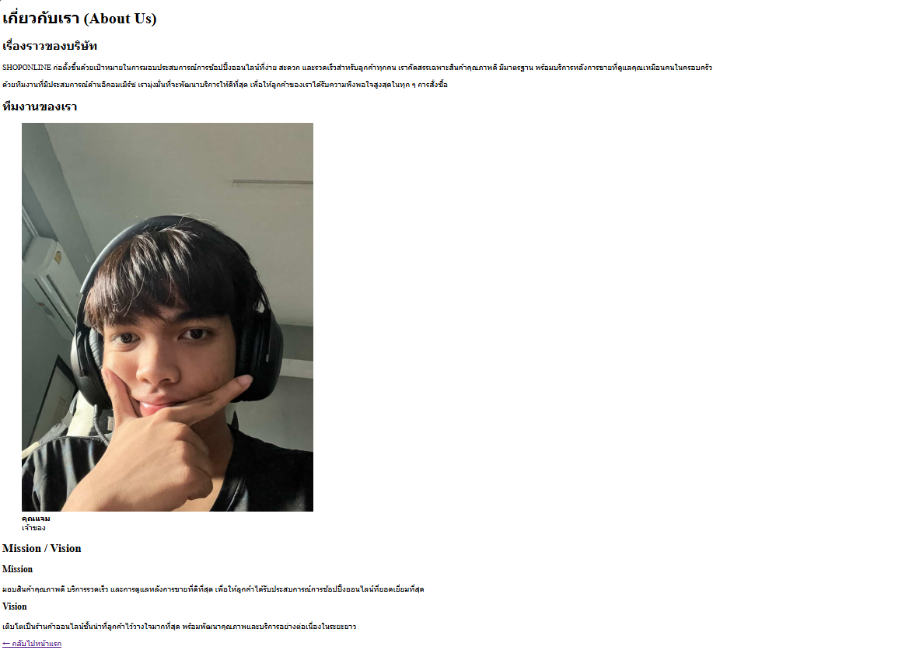
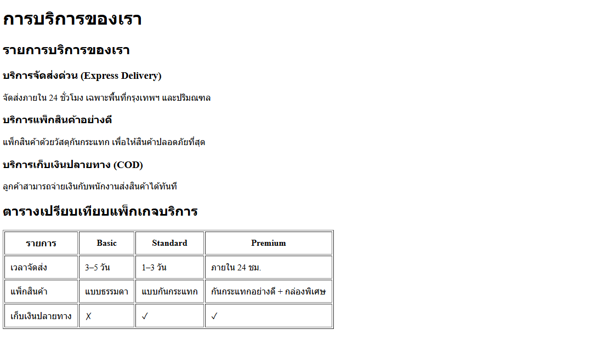
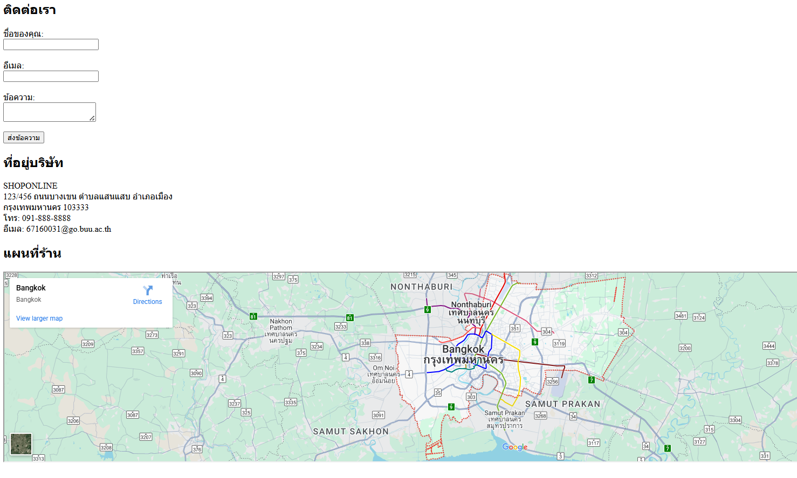

# Create a ShopOnline website

## Projecet description

- นี่คือการจำลองหน้าเว็บไซต์ของ ShopOnline เพื่อใช้เป็นโปรเจกต์ฝึกทักษะ
- สร้างขึ้นเพื่อเรียนรู้วิธีการเขียนหน้าเว็บด้วย HTML พื้นฐาน
- เพื่อฝึกการแบ่งโครงสร้างหน้าเว็บ เช่น หน้าแรก เกี่ยวกับ บริการ ติดต่อ
- ไม่มีการใช้ CSS และ JavaScript (HTML ล้วน)
- เนื้อหา ข้อมูลบริษัท เบอร์โทร และแผนที่ เป็นข้อมูลจำลองทั้งหมด

## File structure

- **index.html** – หน้าแรกของเว็บไซต์ พร้อม Hero section และ Featured Services
- **about.html** – หน้าเกี่ยวกับบริษัท มีเรื่องราวของบริษัท วิสัยทัศน์ พันธกิจ และทีมงาน
- **services.html** – หน้าบริการ แสดงรายละเอียดบริการของ ShopOnline และตารางเปรียบเทียบแพ็กเกจ
- **contact.html** – หน้าติดต่อ มี Contact Form, ข้อมูลบริษัทจำลอง และ Google Maps (จำลองตำแหน่ง)
- **images** – ใช้สำหรับเก็บภาพที่ใช้ในหน้าเว็บไซต์
- **README.md** – เอกสารสำหรับอธิบายโปรเจกต์เว็บไซต์นี้

## All screenshots and links to each page

### 1. หน้าแรก (Home)

[คลิกเพื่อดูหน้าแรก](./index.html)

### 2. หน้าเกี่ยวกับเรา (About)

[คลิกเพื่อดูเกี่ยวกับ](./about.html)

### 3. หน้าบริการ (Services)

[คลิกเพื่อดูบริการ](./services.html)

### 4. หน้าติดต่อ (Contact)

[คลิกเพื่อดูติดต่อ](./contact.html)

